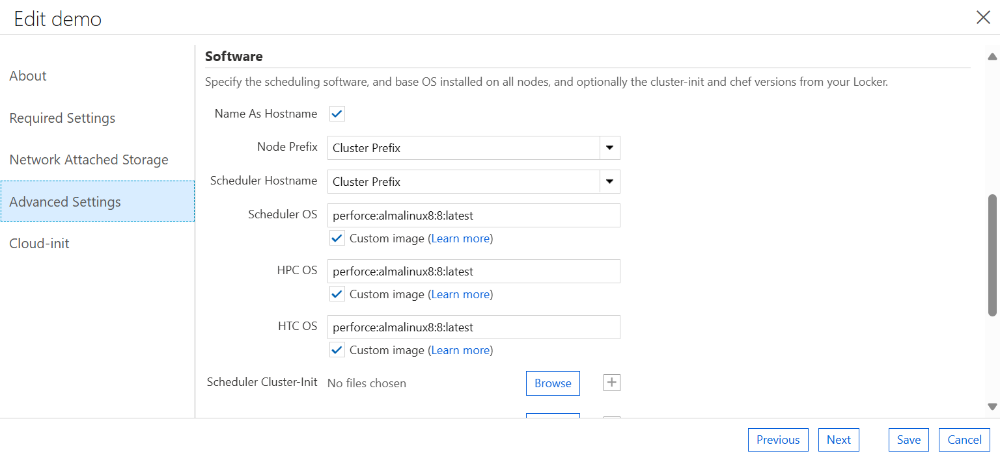

# AzureCycleCloudArmTemplate
AzureCycleCloudArmTemplate

Note:

1. The cluster name should not contain any spaces.

2. Under Scheduler, HCP and HTC OS, select Custom OS and use the following image reference:

    perforce:almalinux8:8:latest

    